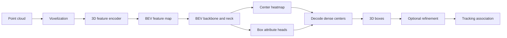

# CenterPoint From Scratch

An educational, from-scratch reimplementation of [**CenterPoint**](https://arxiv.org/abs/2006.11275),
focused first on the pinned one-stage nuScenes VoxelNet detector.

This repository has three goals:

1. Build the CenterPoint model without relying on an existing detector implementation.
2. Reproduce the results reported by the original work through a documented and repeatable pipeline.
3. Explain the model architecture in Jupyter notebooks, including implementation details that are often omitted from papers.

> **Project status:** Work in progress. Implementations, experiments, and reproduced
> metrics will be added incrementally. Until a result is accompanied by a configuration,
> checkpoint, and evaluation log, it should not be considered reproduced.

## Why This Repository?

Research papers explain the main ideas, but learners still have to resolve many practical
questions: How are point clouds converted into features? How do tensor shapes change?
How are targets generated near feature-map boundaries? How is the heatmap loss computed?
What exactly happens during decoding and non-maximum suppression?

This project aims to make those details inspectable. The implementation will favor clear,
well-tested components, while the notebooks will connect equations and diagrams to executable
code.

This project is part of a from-scratch 3D perception reimplementation series. See also
[DETR3D in Pure PyTorch](https://github.com/bskkimm/DETR3D-Implementation-using-Pytorch),
which follows the same emphasis on framework-independent implementation, reproducible results,
and executable architecture explanations.

## CenterPoint at a Glance

CenterPoint represents each 3D object by the center of its bounding box. The detector predicts
a heatmap of likely object centers and regresses box properties at those locations. A second
stage can refine the proposals using features sampled around predicted box faces. Tracking is
performed by associating objects through their predicted centers and velocities.



The main prediction targets are expected to include:

- Class-specific center heatmaps
- Sub-voxel center offsets
- Height, dimensions, and orientation
- Velocity for supported datasets and tracking experiments

## Learning Path

The notebooks are planned as a progressive walkthrough rather than a collection of demos.

| Notebook | Topic | Key questions |
| --- | --- | --- |
| `01_point_cloud_and_voxels.ipynb` | Point-cloud preprocessing | How do ranges and voxel sizes determine tensor shapes? |
| `02_voxel_feature_encoder.ipynb` | Voxel feature extraction | How are unordered points encoded into voxel features? |
| `03_sparse_to_bev.ipynb` | Sparse 3D backbone | How are sparse features transformed into BEV features? |
| `04_center_head_targets.ipynb` | Center-based targets | How are Gaussian heatmaps and regression targets constructed? |
| `05_losses_and_training.ipynb` | Optimization | How do focal and regression losses interact? |
| `06_decode_and_nms.ipynb` | Inference | How do network outputs become metric-space 3D boxes? |
| `07_centerpoint_end_to_end.ipynb` | Full architecture | How do data and gradients flow through the complete model? |
| `08_tracking.ipynb` | Center-based tracking | How are velocity and center distance used for association? |

Each notebook should include tensor-shape annotations, small synthetic examples, visualizations,
and links to the corresponding production code.

The boundary-complete VoxelNet architecture walkthrough imports the tested package and injects a
tiny notebook-only sparse backend. `SpMiddleResNetFHD` remains an injected, unimplemented
production backend; CUDA and `spconv` integration remain deferred and unimplemented.

```bash
jupyter notebook notebooks/centerpoint_walkthrough.ipynb
```

## Reproduction Plan

Reproduction is more than matching the model class. The following will be controlled and
reported for every experiment:

- Dataset version, split, and preprocessing
- Coordinate conventions, point-cloud range, and voxel size
- Model configuration and parameter count
- Optimizer, learning-rate schedule, batch size, and training duration
- Hardware and software environment
- Random seeds and determinism settings
- Checkpoint, training curves, evaluation logs, and exact evaluation command

### Target Benchmarks

| Dataset | Task | Metrics | Status |
| --- | --- | --- | --- |
| nuScenes | 3D detection | mAP, NDS | Planned |
| nuScenes | 3D tracking | AMOTA, AMOTP | Separate target |
| Waymo Open Dataset | 3D detection | LEVEL_1/LEVEL_2 mAP and mAPH | Separate target |

Reported numbers from the paper and reproduced numbers will be shown side by side only after
the full evaluation artifacts are available.

## Implementation Principles

- **From scratch:** Core CenterPoint modules are implemented in this repository rather than
  imported from a detector framework.
- **Readable:** Names, tensor layouts, coordinate transforms, and non-obvious operations are
  documented close to the code.
- **Testable:** Geometry, target generation, loss, and decoding components receive focused tests.
- **Reproducible:** Experiments are configuration-driven and preserve all relevant metadata.
- **Educational:** Notebooks explain why an operation exists, not only how to call it.

Project contracts and plans:

- [Frozen reproduction baseline](docs/BASELINE.md)
- [Canonical local configuration](centerpoint/config.py)
- [Tensor and coordinate contracts](docs/CONTRACTS.md)
- [Pinned upstream source map](docs/UPSTREAM_MAP.md)
- [Model state-dict contract](docs/STATE_DICT.md)
- [Evidence-gated next steps](docs/NEXT_STEPS.md)

## Repository Layout

```text
.
|-- centerpoint/          # Model, data, geometry, loss, and evaluation code
|-- configs/              # Dataset and experiment configurations
|-- docs/analysis/        # Design decisions and experiment diagnoses
|-- notebooks/            # Architecture explanations and executable walkthroughs
|-- scripts/              # Training, evaluation, and data preparation entry points
|-- tests/                # Unit and integration tests
|-- results/              # Reproduction tables and experiment summaries
|-- pyproject.toml        # Python package metadata
`-- README.md
```

The installation and execution instructions will be added when the first runnable pipeline is
available, so that all documented commands can be verified before publication.

## Roadmap

See the [evidence-gated implementation plan](docs/NEXT_STEPS.md) for detailed deliverables and
merge criteria.

- [x] Establish the initial package structure
- [x] Pin and parity-test the canonical local configuration
- [ ] Define and lock the development environment
- [x] Implement ordered hard voxelization and mean voxel encoding
- [ ] Implement point-cloud loading, sweeps, augmentation, and batching
- [ ] Implement the sparse 3D backbone
- [ ] Implement the BEV backbone and CenterHead
- [x] Implement target generation, losses, and pre-NMS decoding
- [ ] Implement rotated NMS and nuScenes result export
- [x] Add deterministic unit and official-reference parity tests for current primitives
- [ ] Add a small-data overfitting test
- [ ] Train and evaluate detection models
- [ ] Implement center-based tracking
- [ ] Publish architecture notebooks and visualizations
- [ ] Publish checkpoints, logs, configurations, and reproduction tables

## References

- Tianwei Yin, Xingyi Zhou, and Philipp Krahenbuhl. [Center-based 3D Object Detection and Tracking](https://arxiv.org/abs/2006.11275), CVPR 2021.
- [Official CenterPoint repository](https://github.com/tianweiy/CenterPoint)
- [Minimal implementation materials](docs/MATERIALS.md) for official dataset guides,
  canonical configurations, and evaluation references

If this project supports your work, please cite the original CenterPoint paper:

```bibtex
@inproceedings{yin2021centerpoint,
  title     = {Center-based 3D Object Detection and Tracking},
  author    = {Yin, Tianwei and Zhou, Xingyi and Krahenbuhl, Philipp},
  booktitle = {Proceedings of the IEEE/CVF Conference on Computer Vision and Pattern Recognition},
  year      = {2021}
}
```

## Contributing

Issues and pull requests are welcome, especially for correctness fixes, experiment reproduction,
and explanations of implementation details that are difficult to infer from the paper. Please
include tests or reproducible evidence when changing geometry, training targets, or metrics.

## License

A project license has not yet been selected. Until a license is added, the repository remains
all rights reserved by default.
